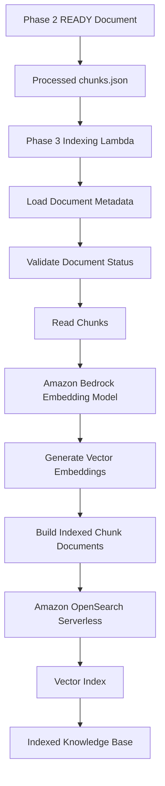

# Architecture Overview
**PHASE 3 STATUS: COMPLETE**

## System Overview
Team Knowledge Finder is designed as a secure, modular RAG application on AWS.

## Architecture Diagram (Phase 3 State)

## Phase Boundaries
- **Phase 3 (COMPLETE)**: Embeddings and vector indexing (Amazon Bedrock & OpenSearch Serverless). 
  - Note: Phase 3 ends at the OpenSearch Vector Index. It does NOT answer questions.
- **Phase 4 (COMPLETE)**: Retrieval and RAG generation.

### Phase 4: RAG Query Pipeline (COMPLETE)
**Goal:** Answer user questions securely based on retrieved evidence.
- **Components:** API Gateway, Query Lambda (`lambdas/query`), Bedrock (Titan Express).
- **Architecture:** 
  `User -> API Gateway -> Query Lambda -> OpenSearch (Retriever) -> Context Filter -> Bedrock -> Citation Validator`

## AWS Architecture
AWS SAM is used for infrastructure as code.
- **S3**: Raw document storage (`documents/raw/`) and Processed chunks (`processed/text/`).
- **DynamoDB**: Metadata storage (document info, statuses).
- **Lambda**: `IngestionLambda` (extract/chunk) and `IndexingLambda` (Bedrock embedding/OpenSearch bulk index).
- **Bedrock**: Text embeddings via `amazon.titan-embed-text-v1`.
- **OpenSearch Serverless**: Vector collection `knowledge_chunks`.

## Security Boundaries
- IAM roles are used to restrict access using the principle of least privilege.
- Lambda roles are explicitly scoped for Bedrock `InvokeModel` and OpenSearch `APIAccessAll`.
- OpenSearch Serverless enforces Encryption, Network, and Data Access security policies.
