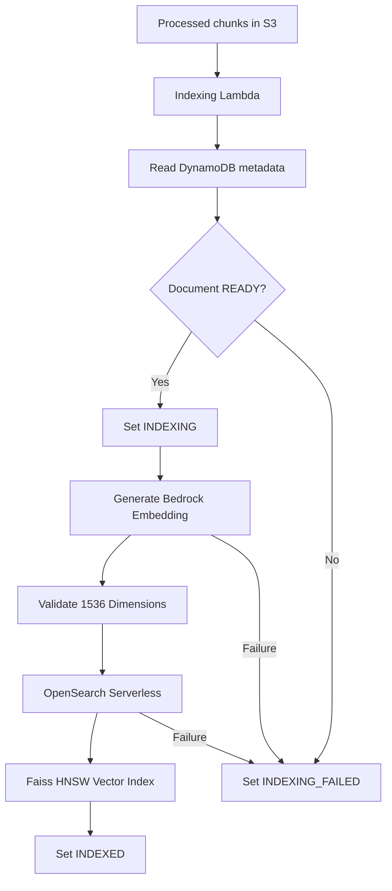
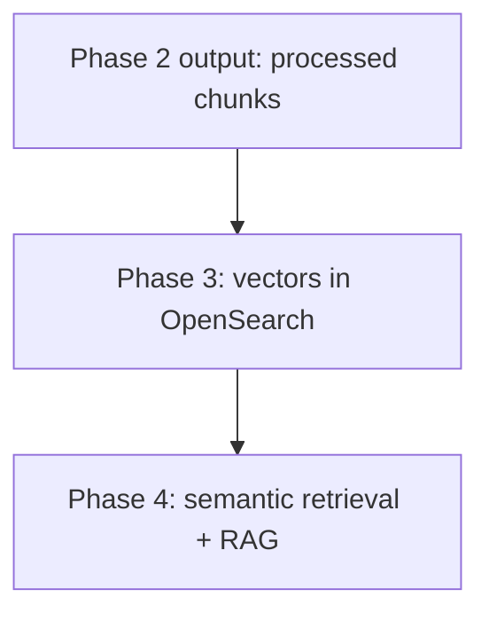
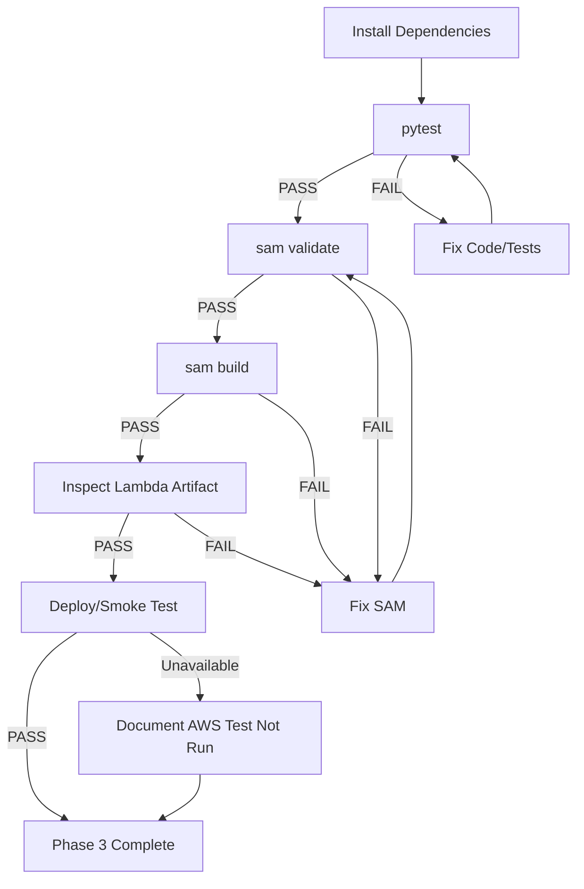

# Team Knowledge Finder
**PHASE 3 STATUS: COMPLETE**

**Team Knowledge Finder** is a secure, source-grounded AI knowledge assistant for teams.

## Problem Statement
Teams struggle to find accurate, up-to-date information across various project documents (PDF, DOCX, PPTX). Current solutions either hallucinate answers without citations or require manual searching through files.

## High-Level Architecture (Phase 3)
1. **Frontend**: Streamlit application for uploading documents.
2. **Backend**: FastAPI for orchestration (Local only, not wired via API Gateway).
3. **Storage**: S3 (Documents & Processed Chunks) and DynamoDB (Metadata).
4. **Compute**: AWS Lambda for ingestion processing and indexing.
5. **Embedding & Vector Search (Phase 3)**: Amazon Bedrock (`amazon.titan-embed-text-v1`) and Amazon OpenSearch Serverless.

## Phase 3: Embeddings + Vector Indexing
The current implementation prepares knowledge base chunks for future retrieval:
- **Embedding Model**: `amazon.titan-embed-text-v1` (1536 dimensions)
- **OpenSearch Serverless Collection**: `knowledge_chunks` vector index using Cosine Similarity (`cosinesimil`).

### Phase 3 Architecture Flow


### Phase 3 Boundary Diagram


### Phase 3 Verification Flowchart


### Canonical Chunk Format & Mappings
The canonical field for chunk content is `text`:
```json
{
  "chunk_id": "DOC-...-CHUNK-0000",
  "document_id": "DOC-...",
  "chunk_index": 0,
  "text": "Example extracted text...",
  "embedding": [0.01, -0.02, ...],
  "page_number": 1,
  "filename": "example.pdf"
}
```

## Phase Status
- **Phase 1** — Foundation — **COMPLETE**
- **Phase 2** — Document Ingestion — **COMPLETE**
- **Phase 3** — Embeddings + Vector Indexing — **COMPLETE**
- **Phase 4** — RAG Query Pipeline — **COMPLETE**
- **Phase 5** — UI Polish — **NOT STARTED**
- **Phase 6** — Review/Flagging — **NOT STARTED**
- **Phase 7** — Access/Freshness/Conflicts/Monitoring — **NOT STARTED**

## Running Locally
**Start the FastAPI Backend:**
```bash
uvicorn backend.app.main:app --reload --port 8000
```
**Start the Streamlit Frontend:**
```bash
streamlit run frontend/app.py
```
