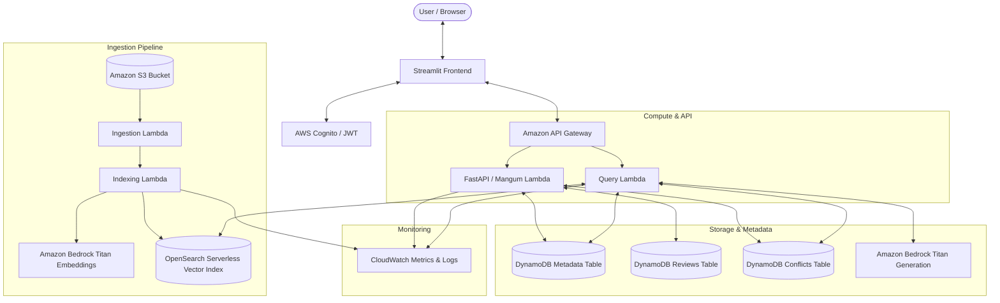

# Team Knowledge Finder

> **A secure, source-grounded AI knowledge assistant for enterprise teams.**

---

## 📖 Problem
Teams face fragmented information across disparate documents (PDF, DOCX, PPTX, XLSX, CSV, Markdown, TXT). Conventional search tools fail to synthesize context, while typical LLM solutions hallucinate answers without citations, lack granular role-based access control, ignore document updates/staleness, and provide no human-in-the-loop auditability.

## 💡 Solution
**Team Knowledge Finder** delivers:
1. **Source-Grounded Answers**: Every answer is strictly derived from verified document passages with `[S#]` inline citations.
2. **Strict Abstention Policy**: The system refrains from answering when approved evidence is insufficient or unauthorized.
3. **Role-Based Access Control (RBAC)**: Hierarchical clearance (`PUBLIC` < `TEAM` < `DEVELOPER` < `ADMIN`) enforced server-side.
4. **Document Freshness & Versioning**: SHA-256 content hashing deduplicates uploads, tracks versions, and marks superseded documents.
5. **Semantic Conflict Detection**: Identifies contradictory policies across documents and highlights them in answers.
6. **Human-in-the-Loop Review System**: Users can flag answers; reviewers can investigate, resolve, dismiss, or archive documents.
7. **CloudWatch Observability**: Structured request tracing and real-time metrics for query latency, abstentions, and security events.

---

## 🏗️ Architecture



---

## 🛠️ Technology Stack

### Frontend
- **Framework**: Streamlit
- **Design Language**: Wanderly Modern SaaS dark/light mode with Glassmorphism
- **API Client**: HTTP REST client with configurable backend endpoints

### Backend
- **Framework**: FastAPI with Mangum AWS Lambda adapter
- **Validation**: Pydantic v2 data models
- **Security**: Cryptographic content hashing (SHA-256), fail-closed RBAC

### AWS Serverless Infrastructure
- **Amazon API Gateway**: REST API with Cognito JWT authorizer
- **AWS Lambda**: Serverless Python 3.11 execution runtime
- **Amazon S3**: Raw and processed document storage
- **Amazon DynamoDB**: Metadata, review audit logs, and semantic conflict tracking
- **Amazon Cognito**: User authentication and group-based clearance claims
- **Amazon Bedrock**: `amazon.titan-embed-text-v1` (1536d) & `amazon.titan-text-express-v1`
- **Amazon OpenSearch Serverless**: Vector collection with cosine similarity index
- **Amazon CloudWatch**: Custom metrics and alarm monitoring

---

## 🔄 How the System Works

### 1. Document Ingestion & Chunking
- When a document is uploaded via `/documents/upload` or direct S3 drop (`documents/raw/{doc_id}/`), the **Ingestion Lambda** extracts text from supported formats (`pdf`, `docx`, `pptx`, `xlsx`, `csv`, `md`, `txt`).
- Text is split into semantically coherent overlapping chunks (600 words, 80-word overlap).

### 2. Embedding & Vector Indexing
- The **Indexing Lambda** invokes Amazon Bedrock Titan to generate 1536-dimensional embeddings.
- Chunks and access metadata are bulk-indexed into OpenSearch Serverless.
- Non-blocking conflict detection scans against other active documents to detect contradictions.

### 3. Grounded Question Answering (RAG)
1. **Auth & Authorization**: The user's JWT claims determine their allowed clearance level (`PUBLIC`, `TEAM`, `DEVELOPER`, `ADMIN`).
2. **Vector Retrieval**: OpenSearch performs k-NN vector search for relevant chunks.
3. **Live Freshness Check**: DynamoDB live query verifies candidate documents are `READY`, `is_current=True`, and not `ARCHIVED`/`SUPERSEDED`/`PENDING_REVIEW`.
4. **Conflict Check**: Retrieved evidence is cross-referenced with known open conflicts.
5. **Bedrock Generation**: Grounded generation model synthesizes an answer referencing source tags (`[S1]`, `[S2]`).
6. **Citation Validation**: Synthesized answers are stripped of any ungrounded assertions. If citations are missing or evidence is insufficient, the system abstains.

### 4. Human-in-the-Loop Flagging & Review
- Users can flag questionable or inaccurate answers (`POST /flags`).
- Flags are persisted to DynamoDB `ReviewsTable` and document state transitions to `PENDING_REVIEW` (temporarily removing it from search results).
- Authorized reviewers (`TEAM`, `DEVELOPER`, `ADMIN`) investigate evidence and resolve flags (`CORRECTED`, `DISMISSED`, `ARCHIVE_DOCUMENT`).

---

## 🚀 Running Locally

### Prerequisites
- Python 3.11+
- AWS CLI configured (for Bedrock/DynamoDB integration if testing against AWS)

### 1. Clone & Setup Environment
```bash
git clone https://github.com/Aryan-Nair-2006/we-kan-code.git
cd we-kan-code

# Create and activate virtual environment
python -m venv .venv
source .venv/bin/activate  # On Windows: .venv\Scripts\activate

# Install dependencies
pip install -r requirements.txt
```

### 2. Start the FastAPI Backend
```bash
uvicorn backend.app.main:app --reload --port 8000
```

### 3. Start the Streamlit Frontend
```bash
streamlit run frontend/app.py
```

---

## ☁️ AWS Deployment (SAM)

### 1. Prepare Build Context
```bash
python scripts/prepare_sam_build.py
```

### 2. Validate SAM Template
```bash
sam validate -t infrastructure/template.yaml
```

### 3. Build & Package
```bash
sam build -t infrastructure/template.yaml
```

### 4. Deploy to AWS
```bash
sam deploy --guided
```

---

## ⚙️ Environment Variables

| Variable | Default | Description |
| :--- | :--- | :--- |
| `ENVIRONMENT` | `local` | `local` (dev auth) or `production` (Cognito JWT enforcement) |
| `AWS_REGION` | `us-east-1` | AWS deployment region |
| `S3_BUCKET_NAME` | `team-knowledge-bucket` | S3 document storage bucket |
| `DYNAMODB_TABLE_NAME` | `team-knowledge-metadata` | DynamoDB metadata table |
| `REVIEWS_TABLE_NAME` | `team-knowledge-reviews` | DynamoDB review table |
| `CONFLICTS_TABLE_NAME` | `team-knowledge-conflicts`| DynamoDB conflict detection table |
| `OPENSEARCH_COLLECTION_ENDPOINT` | `""` | OpenSearch Serverless collection endpoint |
| `BEDROCK_EMBEDDING_MODEL_ID` | `amazon.titan-embed-text-v1` | Bedrock embedding model |
| `BEDROCK_GENERATION_MODEL_ID`| `amazon.titan-text-express-v1` | Bedrock grounded generation model |
| `API_BASE_URL` | `http://localhost:8000` | Backend API URL for Streamlit frontend |

---

## 🧪 Testing

Run the full automated unit, regression, and integration test suite:
```bash
pytest -q
```

All 99+ tests verify:
- Ingestion and chunking logic
- Vector indexing and score normalization
- Grounded answer generation and citation validation
- Abstention on insufficient or unauthorized context
- Fail-closed authentication & role privilege escalation prevention
- Document ACL clearance enforcement
- Freshness hashing & version superseding
- Semantic conflict detection & query awareness
- Human-in-the-loop review lifecycle

---

## 🔒 Security Summary
- **No Hardcoded Credentials**: IAM execution roles and temporary Cognito JWT tokens are utilized exclusively.
- **Fail-Closed Authorization**: Requests lacking valid clearance tokens are rejected with `401 Unauthorized` or `403 Forbidden`.
- **Identity Integrity**: User IDs, flagger identities, and reviewer IDs are authoritatively derived server-side from verified JWT tokens.
- **Prompt Injection Defense**: Retrieved passages are strictly encapsulated as document evidence inside explicit tags.
- **Stale Vector Protection**: Live DynamoDB metadata verification prevents superseded or non-ready OpenSearch chunks from being served.

---

## 📋 Phase Implementation Status
- **Phase 1** — Foundation & Core Framework — **COMPLETE**
- **Phase 2** — Multi-Format Ingestion Pipeline — **COMPLETE**
- **Phase 3** — Bedrock Embeddings + OpenSearch Vector Indexing — **COMPLETE**
- **Phase 4** — Grounded RAG Query Pipeline & Citations — **COMPLETE**
- **Phase 5** — Streamlit SaaS UI & Analytics Dashboard — **COMPLETE**
- **Phase 6** — Review & Flagging Human-in-the-Loop Workflow — **COMPLETE**
- **Phase 7** — Security, Access Control, Freshness, Conflicts & Monitoring — **COMPLETE**
- **Phase 8** — AWS Cloud Integration, SAM Packaging & Deployment — **COMPLETE**
